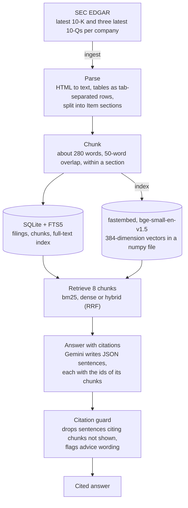
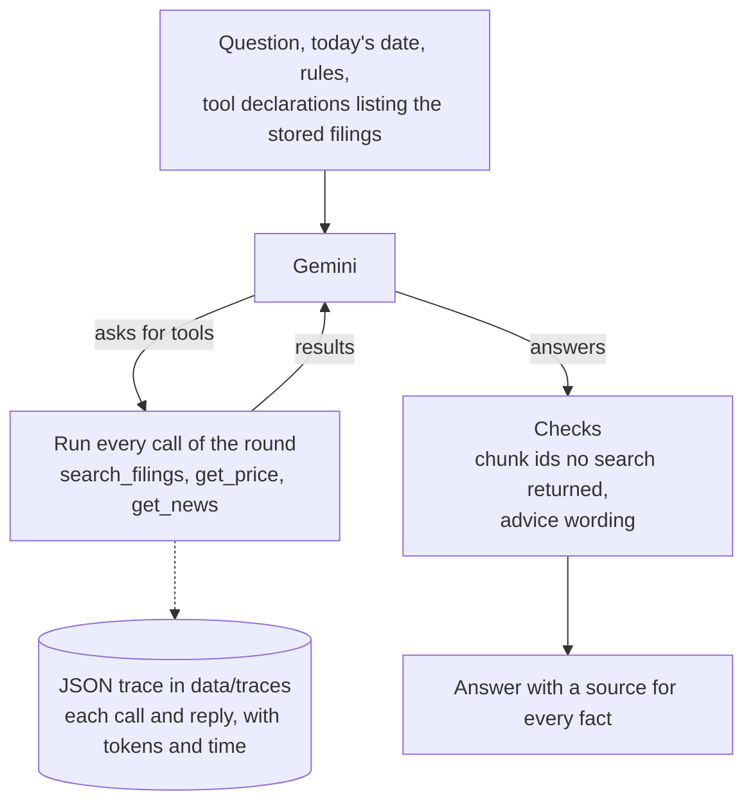

# filings-qa-agent

**English** | [简体中文](README.zh-CN.md)

[](https://github.com/jackieyangjq/filings-qa-agent/actions/workflows/ci.yml)

Question answering over SEC 10-K and 10-Q filings with a checkable source on every sentence, a tool-using research agent, and an evaluation of three ways to retrieve the passages.

It downloads the latest annual (10-K) and quarterly (10-Q) reports of 12 large US companies from SEC EDGAR, cuts them into passages ("chunks") and indexes them for keyword and vector search. `filings-qa ask` has Gemini answer only from the chunks it retrieves, with the id of the source chunk after each sentence, and drops any sentence that cites a chunk the model was not shown. `filings-qa agent` adds daily prices and news headlines as tools, and `filings-qa eval` compares the retrieval strategies on 50 questions. Nothing here is investment advice.

## What you get

`filings-qa demo` runs the answer path offline on six excerpts of real filings that ship with the package. Two stand-ins keep it free of keys and downloads: hashed word vectors instead of the embedding model, and replies written in advance instead of Gemini. Its first line and the last of its three answers:

```text
$ filings-qa demo
filings-qa demo: 3 questions answered offline from 6 excerpts of SEC filings by Apple, NVIDIA and Costco (42 chunks, indexed in a temporary folder).
…
[3/3] How many paid members did Costco have at the end of fiscal 2025, and what was its membership renewal rate?
At the end of 2025, Costco had 81,000 thousand total paid members, up from 76,200 thousand at the end of 2024. [COST-10-K-20251008-1-007]
Costco's member renewal rate at the end of 2025 was 92.3% in the U.S. and Canada and 89.8% worldwide. [COST-10-K-20251008-1-008]
Costco says its worldwide renewal rate is adversely affected by membership growth in newer international markets and by a higher share of memberships sold online, including through digital promotions, which renew at a slightly lower rate on average. [COST-10-K-20251008-7-006]
Citation check: 3 sentences kept, 0 dropped; they cite the chunks ranked 1, 2 and 3 of the 8 retrieved.
Source: COST-10-K-20251008 https://www.sec.gov/Archives/edgar/data/909832/000090983225000101/cost-20250831.htm
```

A chunk id reads `<ticker>-<form>-<filing date>-<section>-<number>`: `COST-10-K-20251008-7-006` is the sixth chunk of Item 7, management's discussion and analysis (MD&A), in the 10-K Costco filed on 2025-10-08. Each excerpt starts where its section starts, so the demo's chunks have the ids that a full ingest gives them, and the same text apart from a page footer left out of NVIDIA's excerpt and the cut-off last chunk of each excerpt: its citations can be checked against the filing.

A real answer, from `filings-qa ask` over the 48 filings on 2026-09-23. gemini-3.5-flash had used up its free daily quota, so the fallback model, gemini-3.5-flash-lite, answered (the line saying so, printed to standard error, is left out):

```text
$ filings-qa ask "What is the total amount authorized under Apple's share repurchase program?" --ticker AAPL
On May 1, 2025, Apple announced a program to repurchase up to $100 billion of its common stock. [AAPL-10-Q-20260501-II-2-001]
On April 30, 2026, Apple announced that the Board of Directors had authorized an additional program to repurchase up to $100 billion of its common stock. [AAPL-10-Q-20260501-II-2-001]
model=gemini-3.5-flash-lite tokens in/out=4601/183 latency=20.0s dropped=0 uncited=0
```

Both sentences say what the cited chunk says: Part II, Item 2 of the 10-Q Apple filed on 2026-05-01.

## How it works



`filings-qa ingest` downloads each company's latest 10-K and three latest 10-Qs from EDGAR, turns the HTML into text, splits it into the filing's Item sections and cuts each section into chunks, which go into SQLite with its built-in full-text search (FTS5); `filings-qa index` adds a vector per chunk from a small embedding model that runs locally. `filings-qa ask` retrieves 8 chunks with BM25 (the standard keyword-ranking formula), with vector similarity ("dense" search) or with both fused by reciprocal rank fusion (RRF), shows them to Gemini under their ids and asks for JSON sentences that each list the chunks they rely on. `guard.py` then drops any sentence citing a chunk that was not shown.



`filings-qa agent` gives Gemini three tools: `search_filings` (the same hybrid search, optionally within one company, form or filing), `get_price` (daily closes from Yahoo Finance through yfinance, counted in trading days) and `get_news` (Finnhub's company news when `FINNHUB_API_KEY` is set, else a Google News RSS search). The loop runs whatever calls the model asks for and sends back the results until it answers; after `--max-steps` rounds (default 6) further calls are refused and the model must answer from what it has.

## Design decisions

### SQLite, FTS5 and numpy instead of a vector database

The index is a few files in `data/index/`: `filings.sqlite` holds the filings, the chunks and the FTS5 index (BM25 ranking, with Porter stemming so that "revenues" finds "revenue"), which triggers keep in step with the chunks, and `embeddings.npy` holds one unit-length float32 vector per chunk. Dense search is a full scan, one matrix-vector product and a sort, and the filters by company, form or filing date are plain SQL, applied to both searches. At this size that is plenty: 9,814 chunks of 384 dimensions take 15 MB, and a query scans them in about 0.6 ms on a laptop. The scan grows linearly, to about 9 ms at 100,000 chunks and 0.1 s at a million (1.5 GB of vectors); around there an approximate nearest-neighbour index or a vector database would start to earn its extra machinery.

### Chunks of 280 words, to fit the embedding model

The embedding model, BAAI/bge-small-en-v1.5, reads at most 512 tokens of a text and ignores the rest. Filing text is token-heavy (figures, tables, legal terms), and the first chunks, of 400 words, had a median of 477 tokens: 37% of them ran past 512, and 9% of all tokens were invisible to dense search. At 280 words, overlapping by 50, the median is 329 tokens, 7% of chunks run over and 1.5% of tokens are cut off. Chunks never cross an Item section, so every chunk id names its section.

### Hybrid search fuses ranks, not scores

Hybrid search takes twice as many chunks as it needs from BM25 and from dense search and merges the two lists by RRF: a chunk scores 1/(60 + rank) for each list it is in, with equal weights, and ties go to BM25 (60 is the constant of the original RRF paper, Cormack et al., 2009). Ranks need no calibration between a BM25 score and a cosine similarity, and the fusion needs no training data. The evaluation shows the cost of equal weights: dense search's misses push some keyword hits out of the top 5 (hybrid recall@5 70.0% against BM25's 75.0%). Weighting the lists, or reranking the fused list, is the next thing to try (see [Roadmap](#roadmap)).

### Every citation must be a chunk the model was shown

`ask` asks Gemini for JSON, a list of sentences each with the ids of the chunks it relies on, and `guard.verify_citations` drops any sentence citing an id that was not among the chunks in the prompt, counting it as `dropped`. The agent writes free text with sources in square brackets, so its check only lists the chunk ids that no search of the run returned, as unsupported, and leaves the text alone: cutting free text into sentences to delete some risks removing the wrong words. Neither check can tell whether a chunk supports the sentence that cites it: in the evaluation's [q06](docs/eval-results.md#two-failure-cases), the model worked out a wrong figure from a chunk it had been shown and cited that chunk.

### A hand-written agent loop, so every step is on record

Automatic function calling is off: `agent.py` sends the question with the three tool declarations, runs the calls the reply asks for, sends back the results and repeats, returning the model's own turn unchanged as Gemini 3 requires when it calls functions. Each tool call is recorded with its arguments, a one-line summary of the result and its time, each model reply with its tokens and time, and the run is saved as a JSON trace in `data/traces/`. `--max-steps` counts rounds, the replies that ask for tools, rather than single calls: gemini-3.5-flash-lite often sends several calls at once and leaves an argument out of one, and when single calls were counted, one bad round could use up the budget. If the model still asks for tools after the last round, those calls are refused, it must answer without tools, and the result is marked truncated.

### An evaluation that survives the free tier

`filings-qa eval` caches each answered and graded question in `data/cache/eval/<strategy>/<qid>.json`, so a run cut short by a quota or the network resumes where it stopped; it waits out per-minute rate limits, and it stops at a used-up daily quota or after three failures in a row. The 50 questions were written by gemini-3.5-flash-lite: 40 from chunks sampled by company and section, each checked by code (the quote is in the chunk, the question names the company and is not a yes/no question), and 10 about companies or a year outside the corpus. Ten were then checked by hand against the filings, and three of them reworded. The judge is flash-lite too, from the same family as the model it grades, so the two may share blind spots; a hand check of 22 of its grades found none wrong.

### No investment advice

Both prompts forbid recommendations to buy, sell or hold and predictions of prices. After generation, `guard.advice_check` looks for 17 phrasings such as "should buy", "strong sell" or "good time to buy": `ask` then prints a note that nothing in the answer is a recommendation, and `agent` appends such a note to its answer and records the match. It is a tripwire for wording, not a judgment of content.

## Evaluation

50 questions (40 answerable from the filings, 10 not), each answered by gemini-3.5-flash-lite from the 8 chunks a strategy retrieved and graded by a second model call against a reference answer, run on 2026-09-23 over the 48 filings (9,814 chunks). The table from [docs/eval-results.md](docs/eval-results.md):

| Strategy | Done | Recall@5 | Recall@10 | Section hit@5 | Correct | Partial | Incorrect | Citation OK | Abstain OK | False abstain | Avg in tokens | Avg out tokens | Avg latency (s) | Est. cost (USD) |
|---|---:|---:|---:|---:|---:|---:|---:|---:|---:|---:|---:|---:|---:|---:|
| bm25 | 50/50 | 75.0% | 87.5% | 85.0% | 95.0% | 0.0% | 5.0% | 94.7% | 100.0% | 5.0% | 4,186 | 94 | 1.06 | $0.0745 |
| dense | 50/50 | 47.5% | 57.5% | 77.5% | 70.0% | 0.0% | 30.0% | 80.7% | 100.0% | 25.0% | 4,850 | 94 | 1.02 | $0.0845 |
| hybrid | 50/50 | 70.0% | 85.0% | 85.0% | 90.0% | 0.0% | 10.0% | 91.9% | 100.0% | 7.5% | 4,472 | 94 | 1.18 | $0.0789 |

Recall (the reference chunk among the first 5 or 10), section hit, the grades, citation OK and false abstain are over the 40 answerable questions, so one question is 2.5 points; abstain OK is over the 10 unanswerable ones. Tokens and latency are averages per answer; the cost is the total for the 50 answers at paid-tier prices, though the runs used the free tier.

BM25 keyword search did best, 95.0% correct, but the questions were written from the chunks and reuse their wording, which favours it; real users paraphrase. Dense search alone was clearly worse, 70.0% (p = 0.006 against BM25 in an exact McNemar test, which compares the questions one strategy got right and the other wrong): it misses chunks that turn on exact names and figures, and the model then declines to answer. Hybrid search came close to BM25 at 90.0% (BM25 got 3 questions right that hybrid missed, hybrid 1 that BM25 missed; p = 0.63), so with 40 answerable questions the gap between them is within chance. The grounding rules held: no sentence cited a chunk the model had not been shown, and all 30 pairs of an unanswerable question and a strategy ended in the model declining.

[docs/eval-results.md](docs/eval-results.md) has the full write-up, with two failure cases, the limitations and how to reproduce the run; [docs/agent-traces.md](docs/agent-traces.md) has three agent runs with every tool call.

## What the first real runs taught us

The agent's tools and prompt were changed after its first real runs; [docs/agent-traces.md](docs/agent-traces.md#what-the-first-runs-changed) lists all six changes. Four of them:

1. **The model cannot know which filings exist.** Asked about NVIDIA's last three filings, it described two older 10-Qs and the 10-K and missed the latest 10-Q. The description of `search_filings` now lists the stored filings with their dates, and its `filed` argument restricts a search to one filing.
2. **Trading days are not calendar days.** "The fifth trading day after the filing" came out anywhere from the fourth to the seventh. `get_price` now takes `trading_days` and returns the close on the start date and on each of the N trading days after it.
3. **News needs a topic.** The ten newest headlines were all from one day, and none was about the capital expenditure asked about. The news tool now keeps the top-ranked headlines of the period, newest first, and takes a topic.
4. **An intraday price is not a close.** During trading hours the model reported today's price as the day's close. That row now carries a note saying it is the latest price, not a close, and the prompt tells the model to call it that.

These changes, and the prompt rules that go with them, were made while looking at failures on the same three questions that the traces show, so they may fit those questions too well: each trace is the first run after the last change, not a test on new questions.

## Run it

Needs Python 3.12 or later. The package is not on PyPI, so install it from GitHub; the demo needs no key, network or optional extra:

```bash
pip install "filings-qa-agent @ git+https://github.com/jackieyangjq/filings-qa-agent"
filings-qa demo
```

For real use, clone the repository, which holds the company list, the evaluation questions and `.env.example`, and install the extras: `embed` (fastembed, for the vectors), `llm` (google-genai) and `tools` (yfinance, for the agent's prices). Then four steps:

```bash
git clone https://github.com/jackieyangjq/filings-qa-agent && cd filings-qa-agent
pip install -e ".[embed,llm,tools]"

# 1. Keys. SEC_USER_AGENT is your name and email, "Name email@example.com": SEC refuses automated requests
#    that give no contact. GEMINI_API_KEY is free from Google AI Studio; FINNHUB_API_KEY is optional.
cp .env.example .env              # fill it in, then load it:
set -a; source .env; set +a

# 2. Download, parse and chunk the filings of the companies in companies.yaml: 12 companies, 48 filings
filings-qa ingest

# 3. Embed every chunk for dense and hybrid search; the model is downloaded once, to data/models
filings-qa index

# 4. Ask a question, research one with tools, or run the evaluation (cached, so it resumes where it stopped)
filings-qa ask "What did NVIDIA say drove data center revenue growth in its most recent quarter?" --ticker NVDA
filings-qa agent "What risks related to tariffs does Tesla disclose, and what has the stock done over the past month?"
filings-qa eval --strategies bm25
```

Everything is written under `data/` (downloads, the index, caches, agent traces), which git ignores. `filings-qa search "<query>" --strategy bm25` shows what a strategy retrieves without asking a model, `filings-qa stats` counts the chunks per company, and `--json` makes `ask` and `agent` print the whole result.

### Tests

```bash
pip install -e ".[dev,embed,llm,tools]"
ruff check . && pytest -q
```

The tests need no network, key or model download: SEC, Gemini, prices and news are replaced by fixtures or stubs, and the vectors come from `FakeEmbedder`. CI runs ruff, the tests and `filings-qa demo` on every push to main and every pull request.

## Limitations

- **12 companies.** The latest 10-K and three latest 10-Qs of 12 large US companies (edit `companies.yaml` for others), and only each filing's main document, with its tables flattened to tab-separated text.
- **A citation is checked for existence, not support.** The guard proves that the cited chunk was shown to the model, not that it says what the sentence says (q06 in the evaluation).
- **The evaluation questions are model-written.** They are fact questions (figures, dates, names) drawn from chunks with numbers in them; 10 of the 50 were checked by hand; the judge is from the same model family as the answerer; and with 40 answerable questions, one question moves a rate by 2.5 points.
- **Free-tier models.** On the free tier gemini-3.5-flash allows few requests a day, so `agent`, `evalset build` and `eval` default to gemini-3.5-flash-lite and every result in `docs/` is flash-lite's; `ask` tries flash first and falls back. The evaluation hit flash-lite's per-minute limit 16 times and waited each one out, and flash-lite does not plan the same way twice, so two runs of the agent on one question can differ.
- **Section labels are unreliable for JPMorgan and Exxon Mobil.** JPMorgan's 10-Qs have no Item headings in the body, and both companies' 10-Ks put the financial statements after Item 15 or 16. The evaluation samples their questions by filing instead of section, and section hit is only a secondary measure.
- **Prices come from yfinance**, an unofficial interface to Yahoo Finance that can break or be rate-limited.
- **News comes from Google News RSS** unless `FINNHUB_API_KEY` is set. It is not an official API, and Google offers the feeds for personal, non-commercial use only; a free Finnhub key switches the tool to Finnhub's company-news API. Headlines are what the outlets wrote, unchecked.
- **The demo shows the mechanics, not the quality:** its vectors are hashed words and its replies were written in advance.
- **Not investment advice.** It reports what the filings, prices and headlines say.

## Repository layout

```
src/filings_qa/
├── cli.py          the filings-qa command: ingest, stats, index, search, ask, agent, evalset build, eval, demo
├── edgar.py        SEC EDGAR: ticker to CIK, latest 10-K/10-Q list, download (with SEC_USER_AGENT, under 10 requests a second)
├── parse.py        filing HTML to text, tables as tab-separated rows; split into Item sections
├── chunk.py        280-word chunks with a 50-word overlap, within a section
├── store.py        SQLite: filings, chunks and the FTS5 index; BM25 search with filters
├── embed.py        embedders (fastembed, or the hashed FakeEmbedder) and the brute-force DenseIndex
├── retrieve.py     bm25, dense and hybrid (RRF) retrieval
├── llm.py          Gemini wrapper: model fallback, retries, usage; FakeLLM and RecordedLLM stand-ins
├── answer.py       the prompt, and the JSON answer with a citation list per sentence
├── guard.py        the citation check and the advice-wording check
├── tools.py        agent tools: search_filings, get_price (yfinance), get_news (Finnhub or Google News)
├── agent.py        the tool-calling loop and its JSON traces
├── evalset.py      evaluation questions written from sampled chunks
├── evaluate.py     answers, grades, metrics and the report; cached and resumable
└── demo/           six filing excerpts (corpus/) and the replies the demo replays
tests/              pytest suite and fixtures; no network, keys or model downloads
docs/               eval-results.md, agent-traces.md
eval/               questions.jsonl (the 50 questions) and results/2026-09-23.json
companies.yaml      the companies and forms that ingest downloads
.env.example        SEC_USER_AGENT, GEMINI_API_KEY and the optional FINNHUB_API_KEY
.github/workflows/  ci.yml: ruff, pytest and the demo on every push
```

## Roadmap

- **A reranker and a larger embedding model:** compare a cross-encoder reranking the fused list, and an embedding model larger than bge-small, with today's three strategies on the same 50 questions, to see whether dense search's misses on exact names and figures can be fixed without losing BM25's precision.

## License

MIT © 2026 Jiaqi Yang. See [LICENSE](LICENSE).
