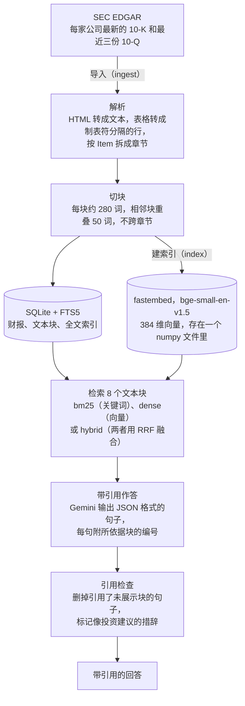
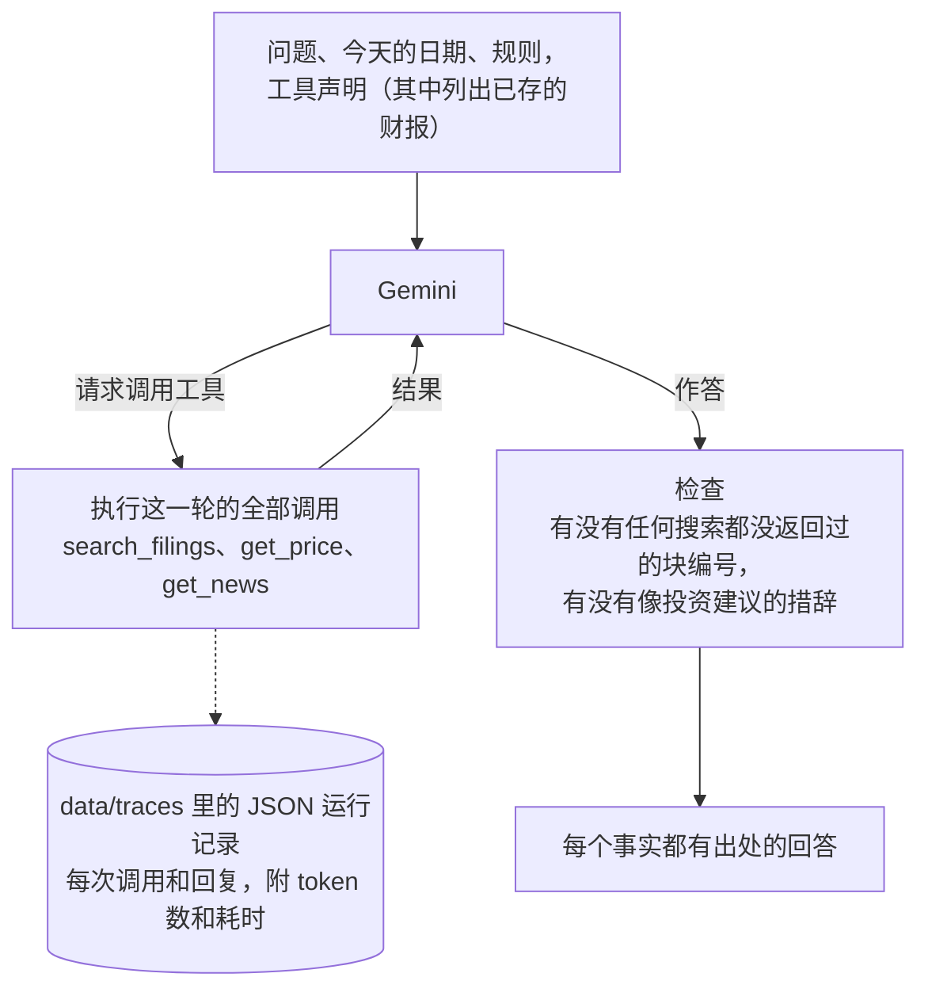

# filings-qa-agent

[English](README.md) | **简体中文**

[](https://github.com/jackieyangjq/filings-qa-agent/actions/workflows/ci.yml)

针对公司向美国证券交易委员会（SEC）提交的 10-K 年报和 10-Q 季报做问答，每句话都附可核对的出处。另外还有一个会调用工具的研究智能体（agent：能自己决定调用哪些工具、分几步完成任务的模型程序），以及对三种段落检索方式的评测。

程序从 SEC 的公开财报库 EDGAR 下载 12 家美国大公司最新的年报（10-K）和季报（10-Q），切成一个个小段落，称为文本块（chunk），再为关键词搜索和向量搜索建好索引。向量是用一串数字表示一段文字的意思，意思相近的文字，向量也相近，所以向量搜索能按意思找段落。`filings-qa ask` 让 Gemini（Google 的大语言模型）只根据检索到的文本块作答，每句话后面写上出处块的编号；某句话如果引用了没给模型看过的块，整句删掉。`filings-qa agent` 在此基础上加了每日股价和新闻标题两个工具，`filings-qa eval` 用 50 道题比较各种检索策略。本项目的任何内容都不构成投资建议。

## 效果展示

`filings-qa demo` 用安装包自带的 6 段真实财报节选，离线跑一遍问答流程。为了不需要密钥、也不用下载，它用了两个替身：嵌入模型（把文字转成向量的模型）换成了单词哈希向量（按固定规则把单词直接换算成数字），Gemini 换成了事先写好的回复。下面是它输出的第一行，以及三个回答中的最后一个：

```text
$ filings-qa demo
filings-qa demo: 3 questions answered offline from 6 excerpts of SEC filings by Apple, NVIDIA and Costco (42 chunks, indexed in a temporary folder).
…
[3/3] How many paid members did Costco have at the end of fiscal 2025, and what was its membership renewal rate?
At the end of 2025, Costco had 81,000 thousand total paid members, up from 76,200 thousand at the end of 2024. [COST-10-K-20251008-1-007]
Costco's member renewal rate at the end of 2025 was 92.3% in the U.S. and Canada and 89.8% worldwide. [COST-10-K-20251008-1-008]
Costco says its worldwide renewal rate is adversely affected by membership growth in newer international markets and by a higher share of memberships sold online, including through digital promotions, which renew at a slightly lower rate on average. [COST-10-K-20251008-7-006]
Citation check: 3 sentences kept, 0 dropped; they cite the chunks ranked 1, 2 and 3 of the 8 retrieved.
Source: COST-10-K-20251008 https://www.sec.gov/Archives/edgar/data/909832/000090983225000101/cost-20250831.htm
```

块编号的格式是 `<股票代码>-<报告类型>-<提交日期>-<章节>-<序号>`。例如 `COST-10-K-20251008-7-006`，就是 Costco 于 2025-10-08 提交的 10-K 里，第 7 项（Item 7，管理层讨论与分析，简称 MD&A）的第 6 块。每段节选都从所在章节的开头截起，所以演示中的块编号与完整导入（ingest）时相同，文字也相同，只有两处例外：NVIDIA 的节选去掉了一行页脚，每段节选的最后一块被截断。因此，演示给出的引用可以拿原始财报核对。

下面是一个真实回答：2026-09-23 在全部 48 份财报上运行 `filings-qa ask` 得到。当时 gemini-3.5-flash 的免费每日额度已经用完，由备用模型 gemini-3.5-flash-lite 作答（说明换了模型的那一行打印到了标准错误输出，也就是与正文分开的提示通道，这里略去）：

```text
$ filings-qa ask "What is the total amount authorized under Apple's share repurchase program?" --ticker AAPL
On May 1, 2025, Apple announced a program to repurchase up to $100 billion of its common stock. [AAPL-10-Q-20260501-II-2-001]
On April 30, 2026, Apple announced that the Board of Directors had authorized an additional program to repurchase up to $100 billion of its common stock. [AAPL-10-Q-20260501-II-2-001]
model=gemini-3.5-flash-lite tokens in/out=4601/183 latency=20.0s dropped=0 uncited=0
```

两句话说的都与所引的块一致。这个块出自 Apple 于 2026-05-01 提交的 10-Q，第二部分第 2 项（Part II, Item 2）。

## 工作原理



`filings-qa ingest` 从 EDGAR 下载每家公司最新的 10-K 和最近三份 10-Q，把网页代码（HTML）转成纯文本，按财报的 Item（项）拆成章节，再把每个章节切成文本块。文本块存进 SQLite（一种单文件的轻量数据库），并用它自带的全文搜索功能 FTS5 建索引。`filings-qa index` 用一个在本机运行的小型嵌入模型，给每个块算一个向量。`filings-qa ask` 检索 8 个文本块，方式有三种：BM25（标准的关键词排序公式，看查询词在块里出现多少次、这个词有多罕见）；向量相似度，也叫稠密检索（dense）；或者用倒数排名融合（RRF：按块在两份结果里的名次打分，再合成一份）把前两种结合起来。检索到的块连同编号一起交给 Gemini，要求它用 JSON（一种程序容易读取的结构化格式）输出句子，每句列出所依据的块。随后 `guard.py` 删掉所有引用了未展示块的句子。



`filings-qa agent` 给 Gemini 三个工具：`search_filings`（同样的混合检索，可以限定在某家公司、某类报告或某一份财报内）；`get_price`（通过 yfinance 这个 Python 库取雅虎财经的每日收盘价，按交易日计数）；`get_news`（设置了 `FINNHUB_API_KEY` 时取金融数据商 Finnhub 的公司新闻，否则搜索 Google News 的 RSS 订阅源，即网站按统一格式发布的更新列表）。循环的做法是：模型请求什么调用就执行什么，把结果发回去，直到它给出回答。满 `--max-steps` 轮（默认 6 轮）后，再有调用请求一律拒绝，模型只能用手头已有的信息作答。

## 设计选择

### 用 SQLite、FTS5 和 numpy，不用向量数据库

索引就是 `data/index/` 里的几个文件。`filings.sqlite` 存放财报、文本块和 FTS5 索引。FTS5 按 BM25 排序，并做 Porter 词干还原（把词的各种变形还原成词干，所以搜 “revenues” 也能找到 “revenue”），这个索引由触发器（数据变动时数据库自动执行的规则）与文本块保持同步。`embeddings.npy` 是 numpy（Python 的数值计算库）格式的文件，为每个文本块存一个向量：由 float32（单精度浮点数）组成，长度归一化为 1。稠密检索就是全量扫描：一次矩阵乘向量，再排一次序。按公司、报告类型或提交日期过滤，用的都是普通 SQL，两种检索都适用。在这个规模下完全够用：9,814 个文本块的向量（每个 384 维，即 384 个数）共占 15 MB，笔记本电脑上一次查询扫描约 0.6 毫秒。扫描耗时随块数线性增长，10 万块约 9 毫秒，100 万块约 0.1 秒（向量共 1.5 GB）。到了那个量级，近似最近邻索引（用一点精度换速度的向量查找结构）或向量数据库，才开始值得它们多出来的那套复杂机制。

### 每块 280 词，为了适配嵌入模型

嵌入模型 BAAI/bge-small-en-v1.5 对一段文字最多只读前 512 个 token，后面的直接忽略。token 是模型计量文字的单位：常见英文单词一般算一个，数字和专业词常被拆成好几个。财报文字很“费” token（数字、表格、法律术语多）。最早的块每块 400 词，token 数的中位数是 477：37% 的块超过 512，全部 token 中有 9% 稠密检索看不到。改成每块 280 词、相邻块重叠 50 词以后，中位数是 329，超长的块占 7%，被截掉的 token 占 1.5%。文本块从不跨越 Item 章节，所以每个块编号都标明了所在章节。

### 混合检索融合名次，不融合分数

混合检索从 BM25 和稠密检索各取两倍于所需数量的文本块，再用 RRF 合并两份名单：一个块出现在哪份名单里，就从那份名单得 1/(60 + 名次) 分，两份名单权重相同，同分时 BM25 优先（60 是 RRF 原始论文用的常数，见 Cormack 等人，2009）。只看名次，就不必在 BM25 分数和余弦相似度（衡量两个向量方向有多接近的指标）之间换算校准，融合也不需要训练数据。评测显示了等权重的代价：稠密检索没找准时，会把一些关键词检索命中的块挤出前 5（混合检索的召回率@5 为 70.0%，BM25 为 75.0%；召回率@5 指答案所在的块排进前 5 的题目比例）。下一步要试的是给两份名单加权，或者对融合后的名单做重排（用更精细的模型给候选块重新排序），见[后续计划](#后续计划)。

### 每条引用都必须是给模型看过的块

`ask` 要求 Gemini 返回 JSON：一组句子，每句附上所依据块的编号。`guard.verify_citations` 逐句检查：某句引用的编号如果不在提示词（发给模型的全部输入）给出的块里，就删掉这句，并计入 `dropped`（已删除句数）。智能体写的是自由文本，出处放在方括号里，所以对它的检查只把本次运行中任何搜索都没返回过的块编号列为“无依据”，正文不动：把自由文本拆成句子再删掉几句，有可能删错。两种检查都判断不了一个块是否真的支持引用它的句子。评测中的 [q06](docs/eval-results.md#two-failure-cases)（英文）就是这样：模型从一个给它看过的块里算出了错误的数字，并引用了这个块。

### 手写智能体循环，每一步都有记录

自动函数调用（由开发库替模型执行它请求的函数，再把结果交回）是关闭的。`agent.py` 把问题连同三个工具的声明（工具名、用途和参数）发给模型，执行回复中请求的调用，把结果发回去，如此反复；按 Gemini 3 调用函数时的要求，模型自己那一轮的回复原样传回。每次工具调用都记下参数、一行结果摘要和耗时，每次模型回复都记下 token 数和耗时，整次运行存成 `data/traces/` 里的一份 JSON 运行记录（trace）。`--max-steps` 数的是轮次，也就是请求调用工具的回复次数，而不是单次调用：gemini-3.5-flash-lite 常常一次发出好几个调用，其中一个漏掉参数；按单次调用计数时，一轮出错就可能把步数用光。如果最后一轮之后模型仍要调用工具，这些调用会被拒绝，模型必须不用工具直接作答，结果标记为截断（truncated）。

### 免费额度下也能跑完的评测

`filings-qa eval` 把每道答完并评完分的题缓存到 `data/cache/eval/<strategy>/<qid>.json`（每种检索策略、每道题一个文件），所以因额度或网络中断的运行，可以从停下的地方接着跑。遇到每分钟的频率限制，它会等限制过去；每日额度用完，或者连续失败三次，就停下来。50 道题由 gemini-3.5-flash-lite 编写：40 道从按公司和章节抽取的文本块中出题，每道都经代码检查（引文确实在块里，题目点明了公司，而且不是是非题）；另外 10 道问的是语料（已下载的全部财报）以外的公司或年份。之后对照财报人工核查了其中 10 道，改写了其中 3 道。负责评分的裁判模型也是 flash-lite，与它评分的模型同属一个系列，两者可能有同样的盲区；人工抽查了它给出的 22 个评分，没有发现错判。

### 不给投资建议

两个提示词都禁止给出买入、卖出或持有的建议，也禁止预测价格。回答生成后，`guard.advice_check` 会查找 17 种说法，比如 “should buy”（应该买入）、“strong sell”（强烈卖出）、“good time to buy”（买入好时机）。一旦命中，`ask` 会打印一条说明，指出回答中的内容都不是投资建议；`agent` 会把这样的说明附在回答末尾，并记录命中的说法。这只是针对措辞的报警线，不是对内容的判断。

## 评测

共 50 道题，其中 40 道能从财报中找到答案，10 道不能。每道题由 gemini-3.5-flash-lite 根据某种检索策略取回的 8 个文本块作答，再由另一次模型调用对照参考答案评分。评测于 2026-09-23 在 48 份财报（9,814 个文本块）上运行。下表摘自 [docs/eval-results.md](docs/eval-results.md)（英文）：

| 检索策略 | 完成 | 召回率@5 | 召回率@10 | 章节命中率@5 | 正确 | 部分正确 | 错误 | 引用正确 | 正确弃答 | 误弃答 | 平均输入 token | 平均输出 token | 平均耗时（秒） | 估算费用（美元） |
|---|---:|---:|---:|---:|---:|---:|---:|---:|---:|---:|---:|---:|---:|---:|
| bm25 | 50/50 | 75.0% | 87.5% | 85.0% | 95.0% | 0.0% | 5.0% | 94.7% | 100.0% | 5.0% | 4,186 | 94 | 1.06 | $0.0745 |
| dense | 50/50 | 47.5% | 57.5% | 77.5% | 70.0% | 0.0% | 30.0% | 80.7% | 100.0% | 25.0% | 4,850 | 94 | 1.02 | $0.0845 |
| hybrid | 50/50 | 70.0% | 85.0% | 85.0% | 90.0% | 0.0% | 10.0% | 91.9% | 100.0% | 7.5% | 4,472 | 94 | 1.18 | $0.0789 |

表中 bm25、dense、hybrid 分别是关键词检索、稠密检索和混合检索。召回率@5、召回率@10 指答案所在的块排进前 5、前 10 的比例；章节命中率@5 指前 5 名里至少有一块与答案出自同一份财报的同一章节；引用正确指带引用的句子中，所引的块是答案所在块、或与它同属一份财报同一章节的比例。弃答是模型表示资料里没有答案、不作回答：正确弃答是不可回答的题里模型拒答的比例，误弃答是可回答的题里模型拒答的比例。召回率、章节命中率、三档评分、引用正确和误弃答都以 40 道可回答的题为基数，所以一道题相当于 2.5 个百分点；正确弃答以 10 道不可回答的题为基数。token 数和耗时是每个回答的平均值；费用是 50 个回答按付费档价格算出的总额，不过实际运行用的是免费档。

BM25 关键词检索表现最好，正确率 95.0%。不过题目是照着文本块出的，沿用了块里的措辞，这对关键词检索有利；真实用户提问时往往会换个说法。只用稠密检索明显更差，正确率 70.0%（与 BM25 相比 p = 0.006，用的是精确 McNemar 检验：只比较一种策略答对、另一种答错的那些题；p 值越小，这个差距越难用偶然解释）。原因是它会漏掉那些要靠确切名称和数字才能找到的块，模型随后便拒绝作答。混合检索接近 BM25，正确率 90.0%（BM25 答对而混合检索答错的有 3 道，反过来有 1 道；p = 0.63），所以就 40 道可回答的题而言，两者的差距仍在偶然波动的范围内。只依据资料作答的规则守住了：没有一句话引用模型没看过的块；不可回答的题与检索策略两两组合共 30 组，模型全部拒答。

完整报告见 [docs/eval-results.md](docs/eval-results.md)，包括两个失败案例、局限和复现方法；[docs/agent-traces.md](docs/agent-traces.md)（英文）记录了智能体的三次运行和每一次工具调用。

## 最初几次真实运行的教训

智能体最初几次真实运行之后，它的工具和提示词都改过；全部六处改动见 [docs/agent-traces.md](docs/agent-traces.md#what-the-first-runs-changed)（英文）。下面是其中四处：

1. **模型无从知道有哪些财报。** 问到 NVIDIA 最近三份财报时，它讲了两份较早的 10-Q 和那份 10-K，漏掉了最新的 10-Q。现在 `search_filings` 的说明里列出了已存的财报及日期，`filed` 参数可以把搜索限定在某一份财报内。
2. **交易日不是日历日。** 问“财报提交后第五个交易日”，模型取到的日期从第四个到第七个交易日不等。现在 `get_price` 接受 `trading_days` 参数，返回起始日以及之后 N 个交易日每天的收盘价。
3. **新闻要有主题。** 最新的十条标题全是同一天的，也没有一条讲到所问的资本开支。现在新闻工具保留这段时间里排名靠前的标题，按从新到旧排列，并且可以指定主题。
4. **盘中价不是收盘价。** 交易时段内，模型把当天的实时价格说成了收盘价。现在这一行数据附有说明，注明它是最新价、不是收盘价，提示词也要求模型这样称呼它。

这些改动和配套的提示词规则，都是对着运行记录里那三道题的失败做的，所以可能过于贴合这三道题：每份运行记录都是最后一次改动之后的第一次运行，而不是在新题目上的检验。

## 运行方法

需要 Python 3.12 或更高版本。这个包没有发布到 PyPI（Python 官方的软件包仓库），所以从 GitHub 安装。演示本身不需要密钥、网络或任何可选依赖：

```bash
pip install "filings-qa-agent @ git+https://github.com/jackieyangjq/filings-qa-agent"
filings-qa demo
```

正式使用时，先克隆仓库（里面有公司名单、评测题和 `.env.example`），再装上三组可选依赖（extra，按需安装的附加包）：`embed`（fastembed，用来算向量）、`llm`（google-genai，Google 的 Gemini 开发库）和 `tools`（yfinance，给智能体取股价）。然后分四步：

```bash
git clone https://github.com/jackieyangjq/filings-qa-agent && cd filings-qa-agent
pip install -e ".[embed,llm,tools]"

# 1. 密钥。SEC_USER_AGENT 填你的名字和邮箱，格式为 "Name email@example.com"：SEC 会拒绝不留
#    联系方式的自动请求。GEMINI_API_KEY 可在 Google AI Studio 免费申请；FINNHUB_API_KEY 可不填。
cp .env.example .env              # 填好后加载：
set -a; source .env; set +a

# 2. 下载、解析 companies.yaml 中各公司的财报并切块：12 家公司，48 份财报
filings-qa ingest

# 3. 为每个文本块算向量，供稠密检索和混合检索使用；模型只下载一次，存到 data/models
filings-qa index

# 4. 提问、用工具做研究，或者运行评测（有缓存，中断后从停下的地方继续）
filings-qa ask "What did NVIDIA say drove data center revenue growth in its most recent quarter?" --ticker NVDA
filings-qa agent "What risks related to tariffs does Tesla disclose, and what has the stock done over the past month?"
filings-qa eval --strategies bm25
```

所有输出都写在 `data/` 下（下载的财报、索引、缓存、智能体运行记录），git 会忽略这个目录。`filings-qa search "<query>" --strategy bm25` 可以只看某种策略检索到什么，不调用模型；`filings-qa stats` 统计每家公司的文本块数；加上 `--json`，`ask` 和 `agent` 会打印完整结果。

### 测试

```bash
pip install -e ".[dev,embed,llm,tools]"
ruff check . && pytest -q
```

测试（用 Python 常用的测试框架 pytest 编写）不联网、不需要密钥，也不下载模型：SEC、Gemini、股价和新闻都换成了固定的测试数据（fixture）或替身（stub），向量由 `FakeEmbedder` 生成。每次推送到 main 分支、每个拉取请求（pull request），CI（持续集成：代码一推送就自动运行的检查）都会运行 ruff（Python 代码检查工具）、全部测试和 `filings-qa demo`。

## 局限

- **只有 12 家公司。** 收录 12 家美国大公司最新的 10-K 和最近三份 10-Q（要换别的公司，改 `companies.yaml`），而且每份财报只用主文档，其中的表格被压平成制表符分隔的文本。
- **只核对引用是否存在，不核对它是否支持原句。** 检查只能证明被引用的块给模型看过，不能证明块里说的就是句子说的（见评测中的 q06）。
- **评测题是模型出的。** 都是从含数字的文本块中出的事实题（数字、日期、名称）；50 道中有 10 道经过人工核查；裁判模型和答题模型同属一个系列；可回答的题只有 40 道，一道题就会让比例变动 2.5 个百分点。
- **用的是免费档模型。** 免费档的 gemini-3.5-flash 每天只允许很少的请求，所以 `agent`、`evalset build` 和 `eval` 默认用 gemini-3.5-flash-lite，`docs/` 里的所有结果也都出自 flash-lite；`ask` 先试 flash，不行再换备用模型。评测中触发了 16 次 flash-lite 的每分钟频率限制，每次都等限制过去再继续。flash-lite 两次规划的做法不会完全一样，所以同一个问题让智能体跑两次，结果可能不同。
- **JPMorgan 和 Exxon Mobil 的章节标签不可靠。** JPMorgan 的 10-Q 正文里没有 Item 标题，两家公司的 10-K 又都把财务报表放在第 15 或第 16 项之后。因此评测给这两家出题时按财报抽样，而不是按章节，章节命中率也只作为次要指标。
- **股价来自 yfinance**，它是雅虎财经的非官方接口，可能失效，也可能被限流。
- **新闻来自 Google News RSS**，设置了 `FINNHUB_API_KEY` 时除外。它不是官方 API（供程序调用的数据接口），Google 只允许个人、非商业用途使用这些订阅源；申请一个免费的 Finnhub 密钥，新闻工具就会改用 Finnhub 的公司新闻 API。标题是各媒体的原文，未经核实。
- **演示只展示流程，不代表效果：** 它的向量是单词哈希出来的，回复是事先写好的。
- **不构成投资建议。** 它只转述财报、股价和新闻标题的内容。

## 目录结构

```
src/filings_qa/
├── cli.py          filings-qa 命令：ingest、stats、index、search、ask、agent、evalset build、eval、demo
├── edgar.py        SEC EDGAR：股票代码转 CIK（SEC 给公司的编号），列出最新的 10-K/10-Q，下载（带 SEC_USER_AGENT，每秒少于 10 次请求）
├── parse.py        财报 HTML 转文本，表格转成制表符分隔的行；按 Item 拆成章节
├── chunk.py        在章节内切块，每块 280 词，相邻块重叠 50 词
├── store.py        SQLite：财报、文本块和 FTS5 索引；带过滤条件的 BM25 检索
├── embed.py        嵌入器（fastembed，或基于哈希的 FakeEmbedder）和逐一比对全部向量的 DenseIndex
├── retrieve.py     bm25、dense 和 hybrid（RRF）三种检索
├── llm.py          Gemini 封装：备用模型切换、重试、用量统计；FakeLLM 和 RecordedLLM 两个替身
├── answer.py       提示词，以及每句带引用列表的 JSON 回答
├── guard.py        引用检查和投资建议措辞检查
├── tools.py        智能体工具：search_filings、get_price（yfinance）、get_news（Finnhub 或 Google News）
├── agent.py        工具调用循环及其 JSON 运行记录
├── evalset.py      根据抽样的文本块编写评测题
├── evaluate.py     作答、评分、指标和报告；有缓存，可断点续跑
└── demo/           六段财报节选（corpus/）和演示回放用的回复
tests/              pytest 测试和测试数据；不联网、不用密钥、不下载模型
docs/               eval-results.md、agent-traces.md（英文）
eval/               questions.jsonl（50 道题）和 results/2026-09-23.json
companies.yaml      ingest 要下载的公司和报告类型
.env.example        SEC_USER_AGENT、GEMINI_API_KEY 和可选的 FINNHUB_API_KEY
.github/workflows/  ci.yml：每次推送都运行 ruff、pytest 和演示
```

## 后续计划

- **重排模型和更大的嵌入模型：** 在同样的 50 道题上，拿两种做法和现有三种策略比较：一是用交叉编码器（把问题和候选块放在一起逐对打分的模型）对融合后的名单重排，二是换一个比 bge-small 更大的嵌入模型。目的是看稠密检索在确切名称和数字上的漏检能否补上，同时不损失 BM25 的精准。

## 许可证

MIT © 2026 Jiaqi Yang。MIT 是一种宽松的开源许可证，详见 [LICENSE](LICENSE)。
